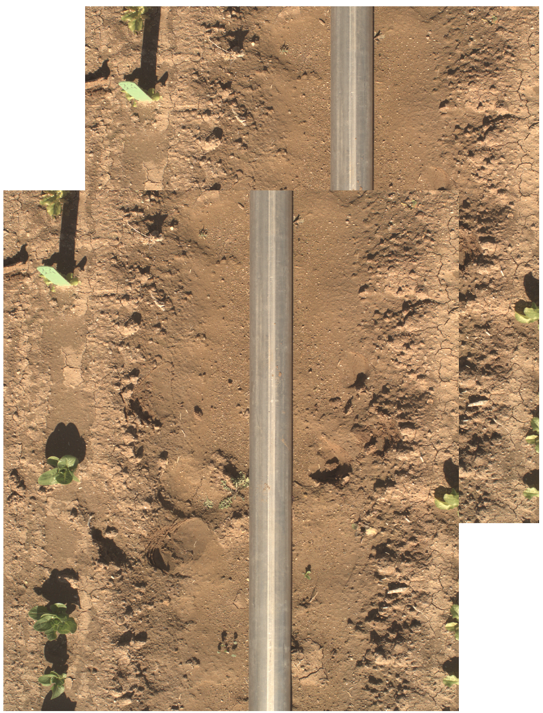

# TIFF metadata tool (TMT) 
High-throughput phenotyping, the use of various sensors to collect plant phenotypic data, has become quite popular in recent years. Often,  images collected may not have the correct GPS coordinates due to slight sensor movement. TMT allows you to load a set of TIFF images that need to be corrected and a CSV file that contains image filenames and bounding coordinates (upper left, lower left, upper right, lower right, and center). The script will open each image using GDAL, replace current coordinates using those on the CSV, and output a new image file with updated coordinates. 

## CSV format 

The CSV file must be in the following format:

|Filename  |Upper left |Lower left |Upper right |Lower right |Center 
--- | --- | --- | --- | --- | --- |
image_left.tif|-111.9750534,33.0745881|-111.9750534,33.0745781|-111.9750445,33.0745881|-111.9750445,33.0745781|-111.9750489,33.0745831

## Running the program

1. Install dependencies by running the following command: 
```
./depend.sh
```

2. You're now ready to go! To run the script, just run:
```
./edit_gps.py <image directory> -c <CSV file path>
```

> The default output directory is `gpscorrect_out/` but you can specify a directory by using the following flag: `-o <output directory>`

## Output image

The corner coordinates of the ouput images will be changed to those listed on the CSV file. You can then visualize your images on QGIS, and you will see that the placement of the images has changed.

<p align="center">
  
</p>

